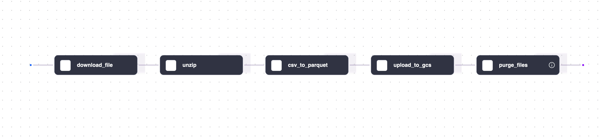
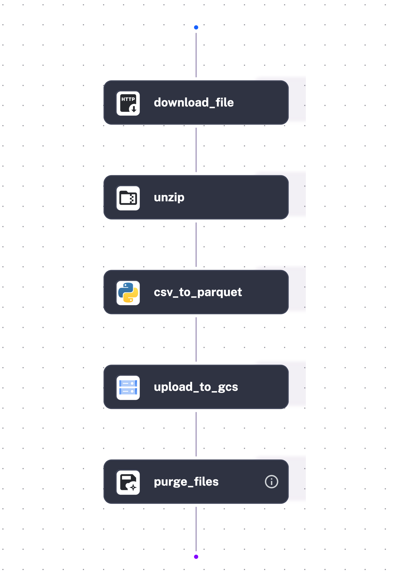

# Kestra Data Engineering Pipeline

This repository contains workflows for orchestrating data engineering tasks using Kestra. The workflows include fetching data, processing it, and uploading it to Google Cloud Storage (GCS).

---

## 🛠️ Prerequisites

Before running the workflows, ensure the following tools and configurations are in place:

- [Docker](https://www.docker.com/products/docker-desktop/) & [Docker Compose](https://docs.docker.com/compose/install/)
- A Google Cloud Platform (GCP) Service Account with the required permissions:
  - Storage Admin
  - Storage Object Admin
  - Any other permissions required for your specific use case

---

## 📌 Starting Kestra

To start Kestra using Docker Compose, run the following commands:

```bash
cd 02-kestra
docker-compose up
```
Once the Kestra UI is loaded, access it at [http://localhost:8080](http://localhost:8080). From the UI, you can execute the workflows described below by navigating to the "Flows" section and selecting the desired workflow to run.

---

## 🔐 Setting Up GCP Credentials in Kestra

To enable seamless integration with Google Cloud Platform, add your GCP credentials in the Kestra UI under the key `GCP_CREDS`. This ensures that workflows can securely access GCP resources.

## 🔑 Workflow 1: `01-gcp_kv` - Configure Environment Variables

The `01-gcp_kv` workflow ([01-gcp_kv.yaml](/02-kestra/flows/01-gcp_kv.yaml)) sets up the following project variables required for the pipeline:

- `gcp_project_id`: Your GCP project ID
- `gcp_location`: The location of your GCP resources
- `gcp_bucket_name`: The name of the GCS bucket where data will be stored
- `gcp_dataset`: The name of the dataset in BigQuery

---

## ⚡ Workflow 2: `02_um-data-gcs-pipeline` - Data Ingestion and Upload to GCS

The `02_um-data-gcs-pipeline` workflow ([02_um-data-gcs-pipeline.yaml](/02-kestra/flows/02-um-data-gcs-pipeline.yaml)) orchestrates the entire data ingestion pipeline. It performs the following steps:

1. **Download file**: Retrieves the ultra-marathon dataset from the kaggle.
2. **Unzip file**: Unzips the downloaded file to extract the data.
3. convert csv to parquet: Converts the CSV files to Parquet format for efficient storage and processing.
5. **Upload to GCS**: Uploads the CSV files to the specified GCS bucket.
6. **Clean Up**: Deletes temporary files to maintain a clean workflow environment.

---

## 📊 Kestra Topology Diagram

The diagram below illustrates the Kestra workflow topology:

<p align="center">
  
</p>
<!-- 
<p align="center">
  
</p> -->
