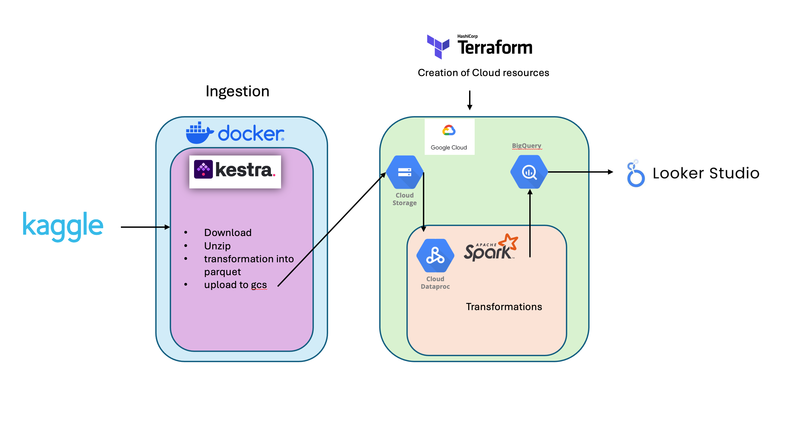
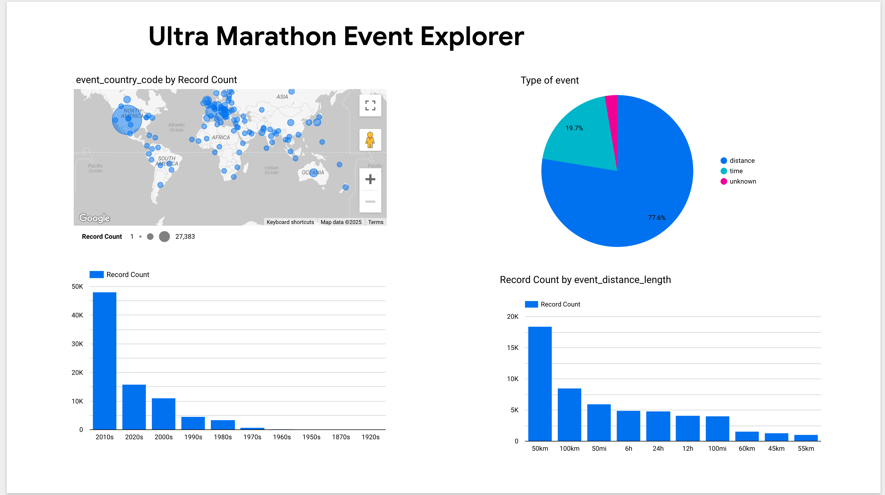

# Ultra Marathon Data Engineering Project

## Project Overview


## 🎯 Problem Statement

The goal of this project is to build a robust data engineering pipeline that ingests [ultra-marathon data from Kaggle](https://www.kaggle.com/datasets/aiaiaidavid/the-big-dataset-of-ultra-marathon-running), processes it, and stores it in Google Cloud Storage (GCS) for further analysis. The primary challenge with this dataset is that it provides an individual-level view of athletes. This pipeline aims to transform the data into an event-level view, enabling the Ultra Marathon Event Explorer to present insights at the event level effectively.

The pipeline will be orchestrated using Kestra, a powerful open-source data orchestration tool, ensuring seamless data processing and management.

To address this problem, we will implement a data engineering pipeline that includes the following steps:
1. **Data Ingestion**: Fetching the ultra-marathon dataset from Kaggle and storing it in Google Cloud Storage (GCS).
2. **Data Transformation**: Converting the data from CSV to Parquet format for efficient storage and processing.
3. **Data Processing**: Using Apache Spark on Google Dataproc to process the data and transform it into an event-level view.
4. **Data Storage**: Storing the processed data in Google BigQuery for further analysis and visualization.
5. **Data Visualization**: Creating an interactive dashboard using Looker Studio to present insights from the processed data.

## 🏗️ Architecture Diagram


Below is the architecture diagram that illustrates the entire data engineering pipeline, from data ingestion to visualization:

<p align="center">
  
</p>

### 1. Pre-requisites
Make sure you have the following pre-installed components: 
* [GCP account](https://cloud.google.com/)
* [Terraform](https://www.terraform.io/downloads)
* [Docker](https://docs.docker.com/get-docker/)


<!-- 1. decide if you want to use your local machine or a virtual machine, if you can follow the instructions from this video https://www.youtube.com/watch?v=ae-CV2KfoN0&list=PL3MmuxUbc_hJed7dXYoJw8DoCuVHhGEQb&index=17


https://cloud.google.com/compute/docs/connect/create-ssh-keys -->


## 🚀 Getting Started

1. Clone this repository:
    ```bash
    git clone https://github.com/your-repo/data-eng-ultra-marathon.git
    ```
2. Set up the infrastructure using Terraform by following the instructions in the [Terraform directory](/01-terraform/README.md).
3. Deploy and configure Kestra by following the steps in the [Kestra directory](/02-kestra/README.md).
4. Proceed with the data processing setup by referring to the [Spark directory](/03-spark/README.md).

---

## 📊 Dashboard

The dashboard provides actionable insights into the ultra-marathon dataset, featuring visualizations and metrics to better understand the data. It is built using Looker Studio and connects to the processed data stored in Google BigQuery.

<p align="center">
  
</p>


> **Note**: The dashboard link is currently being configured for public access. In the meantime, you can view the preview image above.

[View the Dashboard](https://lookerstudio.google.com/reporting/1c8325f4-fadd-41ba-84d8-5fec5240efed)

--
## 📝 Notes

- Ensure your GCP Service Account key is properly configured and accessible.
- Modify the YAML files as needed to suit your specific project requirements.

---

<!-- ## 📂 Directory Structure

```
data-eng-ultra-marathon/
├── kestra/
│   ├── set_kv.yaml
│   ├── data_load_gcs.yaml
│   ├── docker-compose.yml
│   └── README.md
├── images/
│   └── Kestra Flow Diagram.png
└── ...
```

--- -->

## 📧 Support

For any questions or issues, please contact [alvarovs.comprobantes@gmail.com](mailto:alvarovs.comprobantes@gmail.com).

---

[def]: /images/dashboard.pn
[def2]: def